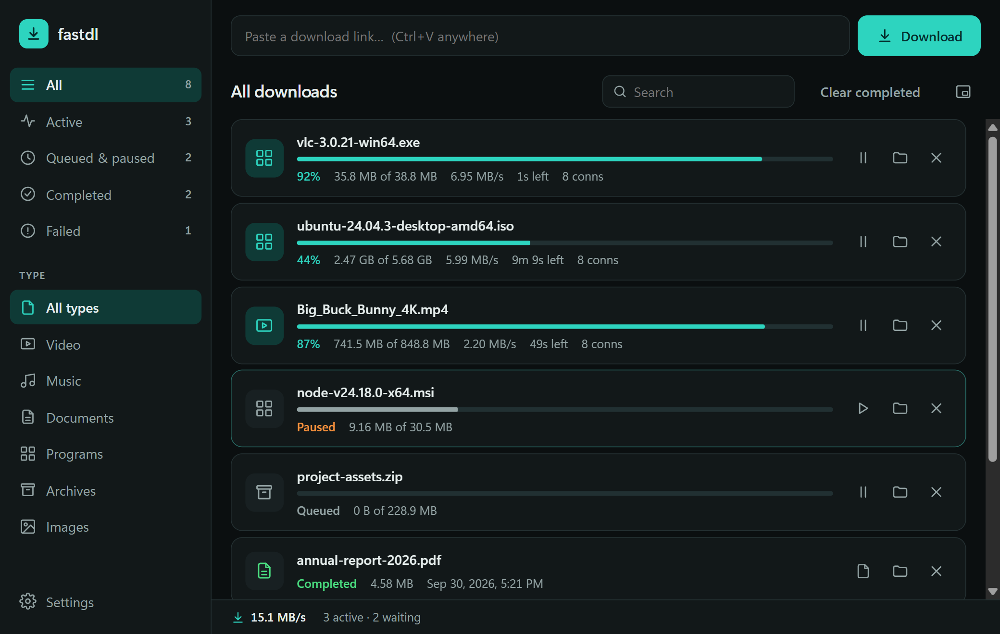

# fastdl

A fast, small, modern download manager for Windows. It's a free, open-source alternative to Internet Download Manager (IDM).

fastdl splits each file into pieces and downloads them over several connections at once, so it's often much faster than downloading in the browser. It ships with a Chrome extension that sends your browser downloads to the app.



## Features

- **Multi-connection downloads.** Files are split into pieces that download in parallel. When one piece finishes early, fastdl splits the biggest remaining piece so every connection stays busy until the end.
- **Pause and resume**, even after closing the app (if the server supports it).
- **Browser extension** for Chrome, Edge, Brave and Opera. Click a download in your browser and fastdl asks where to save it. If fastdl isn't running, the browser downloads normally.
- **Mini view.** A small always-on-top bar with your active downloads (`Ctrl+M`).
- **Queue, speed limit, dark and light themes.**
- **Small.** The installer is about 1.6 MB and the app uses about 30 MB of memory.

## Polite by design (it won't get your IP blocked)

Many servers limit how many connections one person may open, and some temporarily ban IPs that open too many. fastdl is careful:

- 8 connections by default (the same as IDM's default).
- Opens 4 connections at once (browsers use up to 6 per site), then adds the rest one at a time.
- Stops adding connections as soon as a server refuses one, and closes the extras.
- Respects `Retry-After` when a server asks it to wait.
- Identifies itself honestly as `fastdl/<version>` instead of pretending to be a browser.

## Speed

On a local test server that caps each connection at 2 MB/s (like many real download servers):

| File | fastdl | IDM |
|---|---|---|
| 60 MB | 4.9 s (12.2 MB/s) | 5.7 s (10.6 MB/s) |
| 250 MB | 19.0 s (13.1 MB/s) | 19.6 s (12.7 MB/s) |

A single browser-style connection got 1.7 MB/s on the same server. On a server that doesn't cap connections, or when your internet line is the bottleneck, every tool gets the same speed. No download manager can beat your line speed.

You can run the comparison yourself: `node test/vs-idm-local.js` (needs IDM installed and a built engine; see below).

## Install

1. Download `fastdl_x.y.z_x64-setup.exe` from [Releases](../../releases) and run it.
   The app isn't code-signed yet, so Windows may show "Windows protected your PC". Click **More info → Run anyway**.
   **Mac:** download the `.dmg`. It isn't notarized yet, so the first time, right-click fastdl and choose **Open**.
2. **Browser extension (optional):** download `fastdl-extension.zip` from Releases and unzip it. In Chrome, go to `chrome://extensions`, turn on **Developer mode**, click **Load unpacked** and pick the unzipped folder.
3. **Pair them once:** in fastdl open **Settings** and copy the **Browser extension key**. Click the fastdl extension icon in Chrome, paste the key and click **Pair**.
   If you use IDM too, turn off its browser extension, otherwise both will try to grab downloads.

## Security

**Extension ↔ app**
- The extension talks to fastdl only through `127.0.0.1:17385`, which other computers can't reach.
- fastdl only accepts requests carrying the extension's fixed ID as their `Origin`. Browsers don't let websites fake that header, so websites can't push downloads into fastdl.
- **Pairing:** fastdl and the extension share a random key. Before sending anything, the extension asks fastdl to sign a random number with it (HMAC-SHA256), so another program listening on that port never receives your links or cookies. Every download request is signed too, so other programs can't add downloads.
- The `Host` header is checked (blocks DNS-rebinding tricks), and requests have strict size limits and timeouts.

**Downloaded files**
- Finished files get Windows' "downloaded from the internet" mark, just like browser downloads, so SmartScreen and Office Protected View still check them.
- File names from servers are cleaned: no folder tricks (`../`), no invisible characters that could disguise `invoice.exe` as `invoice.pdf`, no Windows device names (`CON`, `NUL`…), no over-long names.
- Every piece the server sends is checked against what was asked for, so a broken server or proxy can't produce a silently corrupted file.
- When resuming, fastdl checks the file hasn't changed on the server (`If-Range`), so you never get a mix of an old and a new version.

**Your data**
- By default the extension has **no access to the websites you visit**. Sending login cookies (for downloads that need you to be signed in) is an opt-in switch, and Chrome asks you to grant that permission first. Cookies are kept in memory only, never written to disk, and are dropped when the download finishes.

The Windows and Mac releases are built by GitHub Actions from this repository's code (see `.github/workflows/release.yml`).

Found a security problem? Please open an issue, or contact the maintainer privately first for anything serious.

## Build from source

Requirements: [Rust](https://rustup.rs), [Node.js](https://nodejs.org) 18+, and on Windows the Microsoft C++ Build Tools ("Desktop development with C++").

```sh
cd app
npm install
npx tauri build          # installer ends up in app/src-tauri/target/release/bundle/
npx tauri dev            # run in development mode
```

The UI in `app/ui/` is plain HTML, CSS and JS with no framework. Opening `app/ui/index.html` directly in a browser shows it with simulated downloads, which is handy for working on the design.

## Tests

```sh
node test/engine-test.js   # builds the Rust engine and tests it against a throttled, flaky local server
node test/test.js          # tests the original Node.js prototype (fastdl.js)
```

The tests check that files come out byte-for-byte correct, that multiple connections are faster, that dropped connections are recovered, and that pause/resume works.

## Project layout

| Path | What |
|---|---|
| `app/src-tauri/src/engine.rs` | Download engine (Rust) |
| `app/src-tauri/src/bridge.rs` | Local endpoint for the browser extension |
| `app/ui/` | App interface |
| `extension/` | Browser extension (Manifest V3) |
| `fastdl.js` | Original Node.js prototype (command line) |
| `test/` | Test servers and tests |

## License

[GPL-3.0](LICENSE). You're free to use, study, change and share fastdl. If you distribute a modified version, it must stay open source under the same license.
